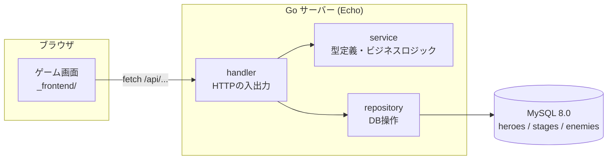
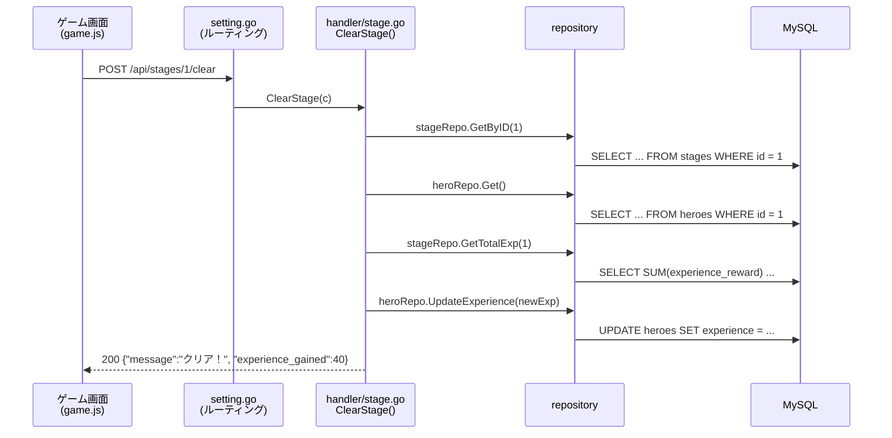
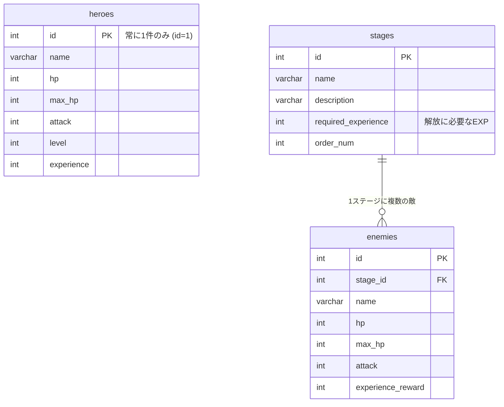

# Gopher Slayer — アーキテクチャ

このドキュメントは、Gopher Slayer の全体構造と「リクエストがどこを通ってDBに届くのか」をまとめたものです。
バグを探すときの地図として使ってください。

## 全体像



- **フロントエンド**（`_frontend/`）はゲーム画面。参加者は触らない。バトル中のHPはフロント側で管理し、サーバーは「ダメージ計算」などの結果だけを返す
- **バックエンド**（`cmd/` + `pkg/`）が今回の主役。Echo で HTTP API を提供する

## レイヤー構成と責務

```
handler → service → repository → DB
```

| レイヤー | 場所 | 責務 | 例 |
|---------|------|------|-----|
| **handler** | `pkg/server/handler/` | HTTPリクエストの受け取り・バリデーション・レスポンス返却 | `c.Bind(&req)` してserviceを呼び、`c.JSON(...)` で返す |
| **service** | `pkg/server/service/` | 型定義（struct）とビジネスロジック | ダメージ計算、封印解除、詠唱中断 |
| **repository** | `pkg/server/repository/` | DBへの SELECT / INSERT / UPDATE | `r.db.QueryRow(...)`、`r.db.Exec(...)` |

**依存の方向は一方通行**（handler → service → repository）。逆流しない。
repository が handler を呼ぶことはないし、service が HTTP のことを知ることもない。

> **設計方針：** この教材では interface による抽象化を意図的に使っていない。
> 初心者が「コードをクリックで辿れば必ず実装に着く」状態を保つため。
> 抽象化を学びたい人は [CHALLENGES.md](CHALLENGES.md) の A-1〜A-3 へ。

## リクエストの流れ（例：ステージクリア）

「ステージ1をクリアした」ときに何が起こるか：



バグを探すときは、この経路を**上から順に**確認していけばよい。
ルーティング（`setting.go`）→ handler → service → repository の順で読むのが基本。

## フォルダ構成

```
.
├── cmd/main.go                # エントリポイント（起動・Lv12/Lv14の修正対象）
├── pkg/
│   ├── constant/constant.go   # 環境変数・設定
│   ├── db/conn.go             # DB接続（Lv14/Lv24の修正対象）
│   └── server/
│       ├── server.go          # Echoの組み立て：ミドルウェア・静的配信・DI（Lv25の修正対象）
│       ├── handler/           # ルーティング + 各API
│       ├── service/           # 型定義 + ロジック（バグの多くはここ）
│       └── repository/        # DB操作
├── db/init/                   # テーブル定義(1_ddl.sql)・初期データ(2_dml.sql)
├── _frontend/                 # ゲーム画面（参加者は触らない）
├── api-document.yaml          # API仕様（OpenAPI）
├── Tasks.md                   # ワークショップタスク（Lv1〜Lv25）
├── ANSWER.md                  # 答え合わせ（講師向け）
└── CHALLENGES.md              # 発展課題
```

### 起動の流れ（`cmd/main.go`）

```
constant.Load()   … 環境変数を読む
    ↓
appdb.Connect()   … MySQLに接続（リトライ付き）
    ↓
server.New(db)    … Echo生成 → ミドルウェア → repository/handler を組み立て → ルート登録
    ↓
e.Start(":8080")  … サーバー起動
```

`server.New` の中で **repository → handler の順に手作業で組み立てて注入**している（手動DI）。
新しいAPIを増やすときも、この組み立てとルート登録（`handler/setting.go`）に追記する。

## API エンドポイント一覧

すべて `/api` プレフィックス付き。ルーティングは `pkg/server/handler/setting.go`。

| メソッド | パス | 内容 | 関連Lv |
|---------|------|------|--------|
| GET | `/hero` | ヒーロー取得 | — |
| PUT | `/hero/name` | 名前更新 | — |
| PUT | `/hero/experience` | 経験値更新 | — |
| PUT | `/hero/hp` | HP更新 | **Lv3**（ルート追加） |
| GET | `/stages` | ステージ一覧（解放状況付き） | — |
| GET | `/stages/:id/enemies` | ステージの敵一覧 | — |
| POST | `/stages/:id/clear` | ステージクリア（EXP付与） | **Lv2**, **Lv10** |
| POST | `/stages/5/challenge` | 封印解除チャレンジ | **Lv6** |
| GET | `/legend` | 古文書の言い伝え | **Lv19** |
| POST | `/battle/attack` | ヒーローの攻撃 | **Lv1**, **Lv4**, **Lv9**, **Lv20** |
| POST | `/battle/enemy-attack` | 敵の攻撃 | **Lv5**, **Lv7**, **Lv17** |
| POST | `/battle/horde` | 群れ討伐 | **Lv8** |
| POST | `/battle/interrupt` | 詠唱中断 | **Lv11**, **Lv23** |
| POST | `/battle/defuse` | 呪いの爆弾解除 | **Lv18** |
| POST | `/quests/gather` | ギルド依頼の調査 | **Lv16** |
| GET | `/debug/memory` | メモリ・goroutine観測（変更不要） | Lv9/Lv17の観測用 |
| GET | `/debug/db` | DBプール統計観測（変更不要） | Lv24の観測用 |

詳細なリクエスト/レスポンス形式は [api-document.yaml](api-document.yaml) を参照。

## DB 構成

MySQL 8.0。テーブルは3つだけ。定義は `db/init/1_ddl.sql`、初期データは `db/init/2_dml.sql`。



- ヒーローは常に `id = 1` の1件だけ（ログイン機能はない）
- ステージの解放判定は「ヒーローのEXP ≧ `required_experience`」をhandler側で計算している

## 状態の持ち方

| 状態 | 置き場所 | 補足 |
|------|---------|------|
| ヒーローのステータス（EXP・最大HP等） | MySQL | リロードしても消えない |
| バトル中のHP（ヒーロー・敵） | フロント（game.js のグローバル変数） | サーバーは計算結果を返すだけ |
| サーバープロセス内の状態 | serviceのグローバル変数 | Lv8のカウンタ、Lv9の怨念、Lv19の解読結果など。**再起動で消える** |

## ワークショップ教材としての仕掛け

- バグが仕込まれている箇所には必ず `[LvN バグ仕込み箇所]` というコメントがある（`grep -rn "バグ仕込み箇所" pkg cmd` で一覧できる）
- `GET /api/debug/memory` と `GET /api/debug/db` は観測用の正しいコード。参加者は変更しない
- `make dev` は [air](https://github.com/air-verse/air) によるホットリロード起動。ファイルを保存すると自動で再起動する（Lv18でサーバーが落ちても勝手に復活する）
- Go 1.25 が必要（Lv23 の `testing/synctest` のため）

## 関連ドキュメント

- [README.md](README.md) — 起動方法
- [Tasks.md](Tasks.md) — ワークショップタスク（Lv1〜Lv25）
- [ANSWER.md](ANSWER.md) — 答え合わせ（講師向け）
- [CHALLENGES.md](CHALLENGES.md) — 発展課題
