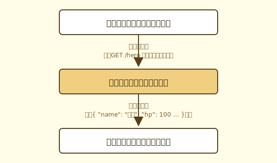

# Webってなに？

## リクエストとレスポンス

さっきSwaggerでAPIを叩いた時、あなたは「Execute」を押しました。あの瞬間、裏側では何が起きていたのでしょうか？

実はあの操作で、ブラウザからサーバーに向けて「データをください」というメッセージが送られていました。このメッセージのことを**リクエスト**、サーバーから返ってきたJSONのことを**レスポンス**と言います。

このブラウザとサーバーの会話の仕組みを**HTTP（HyperText Transfer Protocol）** と言います。WebはこのHTTPという共通のルールの上で動いています。

---

## HTTPメソッド

リクエストには必ず「何をしたいか」という意図が含まれています。これを**HTTPメソッド**と呼びます。

主なHTTPメソッドは4つです。データベースの操作（CRUD）と対応させると覚えやすくなります。

| HTTPメソッド | CRUDの操作 | 意味 | Gopher Slayerの例 |
|---|---|---|---|
| GET | Read（読む） | データを取得する | 勇者の情報を取得する |
| POST | Create（作る） | データを新しく作成する | 新しいステージを作成する |
| PUT | Update（更新する） | データを更新する | 勇者の経験値を更新する |
| DELETE | Delete（削除する） | データを削除する | ステージを削除する |

> [!TIP]
> **補足**  
> HTTPメソッドはこの4つ以外にも `PATCH` や `HEAD` など複数存在します。ただし今回の実装パートで使うのはこの4つなので、まずはこれだけ覚えておきましょう。

---

> [!IMPORTANT]
> **まとめ**
>
> - ブラウザがサーバーに送るメッセージを**リクエスト**、サーバーが返すメッセージを**レスポンス**と言う
> - この会話のルールを**HTTP**と言う
> - リクエストには「何をしたいか」を示す**HTTPメソッド**が含まれる
> - HTTPメソッドはCRUDと対応させると覚えやすい

## コラム：RESTってなに？

APIの設計について調べていると、**REST**や**RESTful**という言葉を頻繁に目にします。

RESTとは**Representational State Transfer**の略で、2000年にRoy Fieldingという研究者が博士論文の中で提唱したWebアーキテクチャの設計原則です。「URLはリソース（名詞）で表現する」「操作はHTTPメソッドで表現する」などのルールがあり、現在のWeb APIの設計において事実上の標準となっています。

Gopher Slayerのバックエンドも、このRESTの考え方に基づいて設計されています。たとえば：

- `GET /hero` → 勇者（リソース）を取得する
- `PUT /hero` → 勇者（リソース）を更新する

動詞をURLに含めるのではなく、HTTPメソッドで操作を表現するのがRESTの考え方です。

**もっと詳しく知りたい人へ**

- RESTの概念をわかりやすく解説：[REST APIを基本から理解する | MuleSoft](https://mulesoft.com/jp/resources/api/what-is-rest-api-design)
- RESTという言葉はなぜこれほど広まったのか。提唱者のFielding自身がHTTP/1.1の設計者でもあるという背景から、Rails登場による誤用の定着まで——読み物として純粋に面白い記事です。[RESTはどのようにバズワード化したか | BEAR Blog](https://koriym.github.io/blog/2026/03/03/rest-how-it-became-buzzword)
