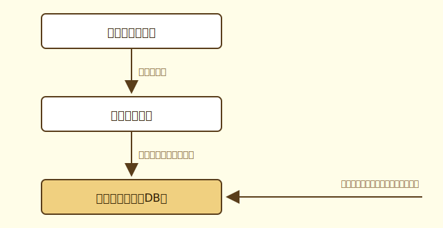

# DBってなに？

## なぜDBが必要か

ここまでで、フロントエンドとバックエンドがAPIを通じてデータをやり取りする仕組みを学びました。では、そのデータはどこに保存されているのでしょうか？

試しに考えてみましょう。Gopher Slayerで勇者が敵を倒して経験値を獲得したとします。もしその経験値をバックエンドのメモリ上だけに持っていたら、サーバーを再起動した瞬間にデータが消えてしまいます。

このように、データをプログラムの外に永続的に保存しておく仕組みが必要です。これが**データベース（DB）** の役割です。




## テーブルとは

DBの中でデータはどのように管理されているのでしょうか。

最もイメージしやすいのは**Excelのシート**です。行と列でデータを管理する表のことを、DBでは**テーブル**と呼びます。

たとえばGopher Slayerの勇者テーブルはこんなイメージです。

| id | name | hp | attack | exp |
|---|---|---|---|---|
| 1 | 勇者 | 100 | 15 | 0 |
| 2 | 戦士 | 120 | 20 | 50 |

- **行**（レコード）：1人の勇者のデータ
- **列**（カラム）：勇者が持つ属性（名前・HP・攻撃力・経験値）

DBには複数のテーブルがあり、それぞれが関連し合いながらデータを管理しています。


## MySQL Workbenchで実際に見てみよう

百聞は一見にしかず、実際にDBの中身を見てみましょう。

**MySQL Workbench**はDBの中身をGUIで確認・操作できるツールです。

### 初期データを確認する

1. MySQL Workbenchを開く
2. Gopher Slayerのデータベースに接続する
3. `heroes` テーブルを開く

さっきの表のようなデータが表示されているはずです。

### 値を手で書き換えてみる

1. `heroes` テーブルの `hp` の値を書き換えて保存する
2. ブラウザでGopher Slayerのフロントエンドを開く
3. 勇者のHPが変わっていることを確認する

自分でDBの値を書き換えたら、フロントエンドの画面に即座に反映されました。これが**データの永続化**です。バックエンドを経由せずに直接DBを書き換えても反映されるのは、フロントエンドが表示するデータの源泉がDBにあるからです。


## GoからDBを呼び出す仕組み

実装パートでは、GoのコードからDBを操作します。どのような仕組みになっているか見てみましょう。

今回の実装では **sqlx** というライブラリを使います。sqlxはGoの標準ライブラリ `database/sql` の薄いラッパーで、SQLをそのまま書きながらGoの構造体にデータをマッピングできます。

### SQLとは

**SQL（Structured Query Language）** はDBに問い合わせるための言語です。「どのテーブルから」「どの条件で」「何をするか」を記述します。

よく使う命令は以下の4つで、CRUDと対応しています。

| SQL | CRUDの操作 | 意味 |
|---|---|---|
| SELECT | Read（読む） | データを取得する |
| INSERT | Create（作る） | データを新しく追加する |
| UPDATE | Update（更新する） | データを更新する |
| DELETE | Delete（削除する） | データを削除する |

### GoからSQLを呼び出す

たとえば勇者の情報を取得するコードはこのようになります。

```go
var hero Hero
err := db.Get(&hero, "SELECT id, name, hp, attack, exp FROM heroes WHERE id = ?", id)
```

- `SELECT id, name, hp, attack, exp FROM heroes` → `heroes` テーブルから指定したカラムを取得する
- `WHERE id = ?` → `id` が一致する行だけを絞り込む
- `&hero` に結果が自動的にマッピングされる

経験値を更新するコードはこのようになります。

```go
_, err := db.Exec("UPDATE heroes SET exp = ? WHERE id = ?", exp, id)
```

- `UPDATE heroes SET exp = ?` → `heroes` テーブルの `exp` カラムを更新する
- `WHERE id = ?` → `id` が一致する行だけを対象にする
- `?` の部分に実際の値が入る

実装パートではこのようなコードを読んだり書いたりしながら、GoとDBの繋ぎを体験していきます。

---

> [!IMPORTANT]
> **まとめ**
>
> - データを永続的に保存する仕組みが**データベース（DB）**
> - DBの中でデータはExcelのシートのような**テーブル**で管理される
> - GoからDBを操作する時はSQLという言語を使う
> - 今回はsqlxというライブラリを使ってSQLを書く


## コラム：GoでDBを扱うライブラリ

GoからDBを操作するためのライブラリはいくつかあります。それぞれ特徴が異なるので、プロジェクトの要件に合わせて選ぶことになります。

### ORM（Object-Relational Mapping）とは

ORMとは、DBのテーブルとGoの構造体を自動的に対応させてくれる仕組みです。SQLを直接書かなくてもGoのコードだけでDBを操作できます。

### 主なライブラリ

**GORM**
GoのORMとして最も長く使われてきたライブラリです。SQLをほとんど書かずにDBを操作できるため、素早く実装できます。その反面、裏側でどんなSQLが実行されているかが見えにくいという面もあります。
- [GORM公式ドキュメント](https://gorm.io/ja_JP/)

**sqlc**
SQLを書いたら型安全なGoのコードを自動生成してくれるツールです。「生SQLで制御したいが、型安全も欲しい」というニーズに答えており、近年急速に普及しています。
- [sqlc公式ドキュメント](https://sqlc.dev/)

**Ent**
Facebookが開発したエンティティフレームワークです。スキーマをGoのコードで定義し、型安全なコードを自動生成します。複雑なデータモデルや関連の扱いに強く、大規模なプロジェクトで採用されています。
- [Ent公式ドキュメント](https://entgo.io/)

**SQLBoiler**
DBのスキーマからGoのコードを自動生成するライブラリです。データベースファーストのアプローチで、生成されたコードは型安全かつ高パフォーマンスです。
- [SQLBoiler GitHub](https://github.com/volatiletech/sqlboiler)
