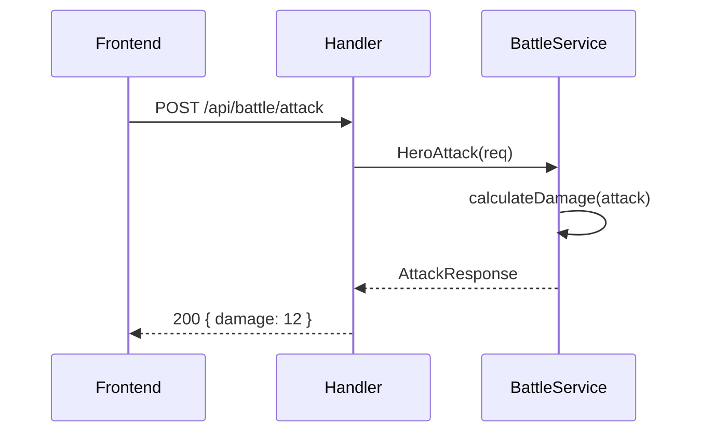
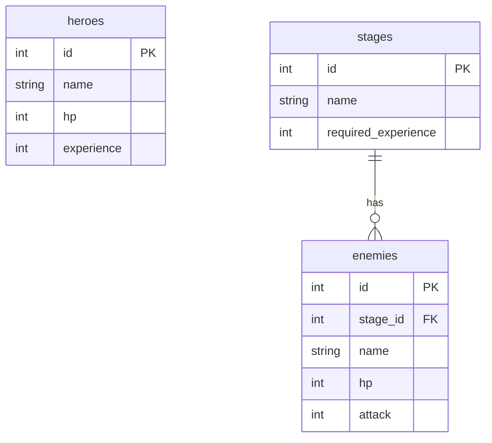

# Gopher Slayer — Optional Challenges

Lv1〜Lv5 のワークショップタスクをクリアしたら、以下の中から好きなものに挑戦しよう。
すべて任意。興味・レベルに合わせて自由に選んでください。

難易度の目安：★ = 30分〜1時間 / ★★★ = 半日 / ★★★★★ = 1日以上

---

## 目次

- [テスト](#テスト)
- [アーキテクチャ・設計](#アーキテクチャ設計)
- [データベース](#データベース)
- [Go 言語深掘り](#go-言語深掘り)
- [API 品質・ミドルウェア](#api-品質ミドルウェア)
- [可観測性](#可観測性)
- [新機能追加](#新機能追加)
- [開発環境・品質管理](#開発環境品質管理)
- [ドキュメント](#ドキュメント)
- [アンチパターン修正](#アンチパターン修正)

---

## テスト

### T-1: Unit Test — calculateDamage のテーブル駆動テスト

**難易度:** ★
**学べること:** `testing` パッケージ, テーブル駆動テスト, テストの書き方の基本

**やること:**

`internal/service/battle_service_test.go` を新規作成し、`calculateDamage` に対してテーブル駆動テストを書く。

```go
tests := []struct {
    name   string
    attack int
    wantMin int
    wantMax int
}{
    {"zero attack", 0, 0, 0},
    {"normal attack", 10, 8, 12},
    {"negative attack", -5, 0, 0},
}
```

**確認コマンド:**

```bash
go test ./internal/service/... -v
```

---

### T-2: Interface 化してモックテストを書く

**難易度:** ★★★
**学べること:** interface による依存の逆転, モックを使ったテスト, 「テストしやすい設計」の意味

**やること:**

1. `internal/repository` に interface を定義する

```go
type HeroRepositoryInterface interface {
    GetHero() (*model.Hero, error)
    UpdateExperience(experience int) error
    UpdateHP(hp int) error
    UpdateName(name string) error
}
```

2. `StageService` が interface に依存するよう変更する
3. テスト用のモック実装を作り、DB なしで `ClearStage` をテストする

```go
type mockHeroRepo struct {
    hero *model.Hero
}
func (m *mockHeroRepo) GetHero() (*model.Hero, error) { return m.hero, nil }
// ...
```

**参考:** `internal/service/stage_service.go` の `StageService` 構造体

---

### T-3: Integration Test — 実 DB を使った API テスト

**難易度:** ★★★
**学べること:** `net/http/httptest`, テスト用 DB の扱い, 統合テストの設計

**やること:**

`internal/handler/hero_handler_test.go` を作成し、`httptest.NewRecorder` を使って `GET /api/hero` のレスポンスを検証する。

```go
func TestGetHero(t *testing.T) {
    // テスト用DBに接続
    // Echo インスタンスを組み立て
    req := httptest.NewRequest(http.MethodGet, "/api/hero", nil)
    rec := httptest.NewRecorder()
    e.ServeHTTP(rec, req)
    assert.Equal(t, http.StatusOK, rec.Code)
}
```

**補足:** `docker-compose up -d` でテスト用 DB を起動した状態で実行する。

---

### T-4: E2E Test — シナリオベースのテスト

**難易度:** ★★★
**学べること:** E2E テストの設計, API シナリオの自動化, テストの粒度の考え方

**やること:**

「ヒーロー作成 → ステージ取得 → ステージクリア → 経験値が増えていること」を1本のテストで検証する。

```go
func TestGameFlow(t *testing.T) {
    // 1. GET /api/hero で初期状態確認
    // 2. GET /api/stages でステージ一覧取得
    // 3. POST /api/stages/1/clear でクリア
    // 4. GET /api/hero で経験値が増えていることを確認
}
```

---

### T-5: テストカバレッジ 80% 達成

**難易度:** ★★★★
**学べること:** カバレッジ計測, テスト計画, 優先順位の付け方

**やること:**

`go test -coverprofile=coverage.out ./...` でカバレッジを計測し、80% を目指してテストを追加する。

```bash
go test -coverprofile=coverage.out ./...
go tool cover -html=coverage.out   # ブラウザで可視化
```

**補足:** 100% を目指すより、重要なビジネスロジック（service層）を優先して高くする。

---

### T-6: Golden File Testing

**難易度:** ★★
**学べること:** スナップショットテスト, リグレッション検知

**やること:**

`EnemyAttack` のレスポンス JSON を `.golden` ファイルに保存し、以降のテストでそのファイルと比較する。

```go
// testdata/enemy_attack.golden を自動生成
// -update フラグで更新できるようにする
if *update {
    os.WriteFile("testdata/enemy_attack.golden", got, 0644)
}
want, _ := os.ReadFile("testdata/enemy_attack.golden")
assert.JSONEq(t, string(want), string(got))
```

---

### T-7: BDD — Gherkin でバトルシナリオを記述する

**難易度:** ★★★★
**学べること:** BDD（振る舞い駆動開発）, `godog` ライブラリ, 仕様と実装の一致

**やること:**

`godog` を導入し、以下のような `.feature` ファイルでテストを記述する。

```gherkin
Feature: Battle
  Scenario: ヒーローが敵を攻撃する
    Given ヒーローの攻撃力が 15 である
    When ヒーローが攻撃する
    Then ダメージが 0 より大きい

  Scenario: 攻撃力0のヒーローはダメージを与えられない
    Given ヒーローの攻撃力が 0 である
    When ヒーローが攻撃する
    Then ダメージが 0 である
```

---

### T-8: TDD でガチャ機能を実装する

**難易度:** ★★★★
**学べること:** TDD（テスト駆動開発）のサイクル（Red → Green → Refactor）

**やること:**

ガチャ機能をテストファーストで実装する。実装前にテストを書き、テストが通るように実装する。

```
1. TestGacha_ShouldReturnWeapon を書く（まだ実装なし → Red）
2. Gacha() を最小限実装して通す（Green）
3. リファクタリング（Refactor）
```

---

### T-9: Race Condition を検出して修正する

**難易度:** ★★★
**学べること:** データ競合, `-race` フラグ, `sync.Mutex` の使い方

**やること:**

以下のバグを `battle_service.go` に仕込んでから `-race` で検出し、修正する。

```go
// バグ: goroutine から共有変数に mutex なしでアクセス
var totalDamage int
go func() { totalDamage += damage }()
```

```bash
go test -race ./...
```

---

## アーキテクチャ・設計

### A-1: Service 間の依存を整理する

**難易度:** ★★★
**学べること:** 依存関係の方向, レイヤーの責務, 「なぜ Service が Repository に直依存してはいけないか」

**現状の問題:**

```
StageService
  ├── stageRepo *repository.StageRepository  // 具体型に依存
  └── heroRepo  *repository.HeroRepository   // 具体型に依存
```

`StageService` が `heroRepo` を直接持っているため、`HeroService` と責務が重複している。

**やること:**

`StageService` が `heroRepo` ではなく `HeroServiceInterface` に依存するよう変更する。

```go
type HeroServiceInterface interface {
    GetHero() (*model.Hero, error)
    UpdateExperience(exp int) error
}

type StageService struct {
    stageRepo   StageRepositoryInterface
    heroService HeroServiceInterface  // repositoryではなくserviceに依存
}
```

---

### A-2: Transaction を追加する

**難易度:** ★★★
**学べること:** `database/sql` のトランザクション, 原子性, ロールバック

**現状の問題:**

`ClearStage` は `UpdateExperience` が失敗しても前の処理がロールバックされない。

**やること:**

`internal/repository/hero_repository.go` に `WithTx` パターンを実装し、`ClearStage` をトランザクションで囲む。

```go
func (r *HeroRepository) WithTx(fn func(tx *sql.Tx) error) error {
    tx, err := r.db.Begin()
    if err != nil {
        return err
    }
    if err := fn(tx); err != nil {
        tx.Rollback()
        return err
    }
    return tx.Commit()
}
```

---

### A-3: クリーンアーキテクチャに寄せる

**難易度:** ★★★★★
**学べること:** レイヤードアーキテクチャとクリーンアーキテクチャの違い, 依存の方向の制約

**現状:** `handler → service → repository`（具体型への依存）

**目標構造:**

```
internal/
  domain/          # ビジネスルール・エンティティ（外部依存ゼロ）
    hero.go
    battle.go
  usecase/         # アプリケーションロジック（domainにのみ依存）
    clear_stage.go
  infrastructure/  # DB・外部サービスの実装
    mysql/
  handler/         # HTTPの入出力
```

**参考:** `internal/service/stage_service.go` の `ClearStage` が usecase の候補

---

### A-4: DDD — Hero をエンティティとして設計する

**難易度:** ★★★★
**学べること:** エンティティ, 値オブジェクト, ドメインロジックをどこに置くか

**やること:**

現在 `service` 層にある `calculateDamage` をドメインロジックとして `Hero` または `Battle` ドメインオブジェクトに移動する。

```go
// domain/hero.go
type Hero struct {
    id         int
    hp         HP      // 値オブジェクト
    attack     Attack  // 値オブジェクト
}

func (h *Hero) AttackEnemy(enemy *Enemy) Damage {
    return h.attack.Calculate()
}
```

---

### A-5: デザインパターンを実装する

**難易度:** ★★★
**学べること:** GoF パターンの実践, パターンが解決する問題

以下から1つ以上選んで実装する。

| パターン | 実装場所のアイデア |
|---------|----------------|
| **Strategy** | ダメージ計算を `DamageStrategy` interface に。通常/クリティカル/毒ダメージを切り替え |
| **Observer** | ステージクリア時にイベントを発火し、経験値付与・ログ記録を別々のハンドラが処理 |
| **Decorator** | `LoggingHeroRepository` で既存 Repository をラップし、全 DB 操作をログ出力 |
| **Functional Options** | `NewBattleService(opts ...Option)` で難易度設定を注入 |

---

### A-6: ADR（Architecture Decision Record）を書く

**難易度:** ★
**学べること:** 技術選定の意思決定を記録する文化, 将来の自分や他人への説明責任

**やること:**

`docs/adr/` ディレクトリを作成し、以下の意思決定を ADR フォーマットで記録する。

```markdown
# ADR-001: Web フレームワークに Echo を採用する

## ステータス
採用済み

## コンテキスト
...

## 決定
...

## 結果
...
```

候補テーマ：「なぜ Echo か（Gin/Chi との比較）」「なぜ ORM を使わないか」「なぜ手動 DI か」

---

## データベース

### D-1: N+1 問題を発見して修正する

**難易度:** ★★★
**学べること:** N+1 クエリの発生パターン, JOIN による解消, `EXPLAIN` の読み方

**やること:**

ステージ一覧に「各ステージの敵一覧」を含めると N+1 が発生する。

```go
// N+1 パターン（悪い例）
for _, stage := range stages {
    stage.Enemies, _ = r.GetEnemiesByStageID(stage.ID) // ステージ数分クエリが走る
}
```

`JOIN` を使って1クエリで解決し、`EXPLAIN` で実行計画を確認する。

```sql
EXPLAIN SELECT s.*, e.* FROM stages s LEFT JOIN enemies e ON e.stage_id = s.id;
```

---

### D-2: Index を追加して EXPLAIN で効果を確認する

**難易度:** ★★
**学べること:** Index の仕組み, `EXPLAIN` の `type` カラム（ALL vs ref）, 設計時の考え方

**やること:**

`enemies.stage_id` にインデックスがない状態で `EXPLAIN` を実行し、追加後と比較する。

```sql
-- 現状確認
EXPLAIN SELECT * FROM enemies WHERE stage_id = 1;

-- インデックス追加
ALTER TABLE enemies ADD INDEX idx_stage_id (stage_id);

-- 再確認
EXPLAIN SELECT * FROM enemies WHERE stage_id = 1;
```

`db/init.sql` に `CREATE INDEX` を追記して管理する。

---

### D-3: Migration ツールを導入する（goose）

**難易度:** ★★★
**学べること:** スキーマのバージョン管理, チーム開発でのDB変更の運用

**やること:**

`goose` を導入し、`db/init.sql` を migration ファイルに分解する。

```
db/migrations/
  00001_create_heroes.sql
  00002_create_stages.sql
  00003_create_enemies.sql
  00004_add_weapons.sql       ← 新機能追加時にここに追記
```

```bash
goose mysql "user:password@/gopher_slayer" up
goose mysql "user:password@/gopher_slayer" down
```

---

### D-4: Redis でヒーロー情報をキャッシュする

**難易度:** ★★★★
**学べること:** キャッシュの設計, Cache-Aside パターン, キャッシュの無効化タイミング

**やること:**

1. `docker-compose.yml` に Redis を追加
2. `GET /api/hero` の結果を Redis にキャッシュ（TTL: 60秒）
3. `PUT /api/hero/*` でキャッシュを削除（Cache Invalidation）

```go
// Cache-Aside パターン
func (r *CachedHeroRepository) GetHero() (*model.Hero, error) {
    if cached := r.redis.Get("hero:1"); cached != nil {
        return cached, nil
    }
    hero, err := r.db.GetHero()
    r.redis.Set("hero:1", hero, 60*time.Second)
    return hero, err
}
```

---

### D-5: DB 変更 — 武器テーブルを追加する

**難易度:** ★★★
**学べること:** スキーマ設計, Migration, 既存テーブルとの関連

**やること:**

```sql
CREATE TABLE weapons (
    id          INT AUTO_INCREMENT PRIMARY KEY,
    name        VARCHAR(100) NOT NULL,
    attack_bonus INT NOT NULL DEFAULT 0,
    rarity      VARCHAR(20) NOT NULL DEFAULT 'common'
);

ALTER TABLE heroes ADD COLUMN weapon_id INT NULL REFERENCES weapons(id);
```

武器装備で攻撃力が変わるよう `battle_service.go` を修正し、`GET /api/hero` のレスポンスに武器情報を含める。

---

## Go 言語深掘り

### G-1: context.Context を全層に伝播させる

**難易度:** ★★★
**学べること:** context の役割（タイムアウト・キャンセル・値の伝播）, Go の慣用句

**現状の問題:**

どの関数も `context.Context` を受け取っていないため、リクエストキャンセル時に DB クエリが止まらない。

**やること:**

全関数のシグネチャに `ctx context.Context` を第1引数として追加し、DB 呼び出しに渡す。

```go
// 変更前
func (r *HeroRepository) GetHero() (*model.Hero, error)

// 変更後
func (r *HeroRepository) GetHero(ctx context.Context) (*model.Hero, error) {
    row := r.db.QueryRowContext(ctx, `SELECT ...`)
}
```

---

### G-2: Goroutine と errgroup で並列処理する

**難易度:** ★★★
**学べること:** `sync/errgroup`, goroutine のエラーハンドリング, 並列処理のパターン

**やること:**

`GetAllStages` でヒーロー情報とステージ一覧を並列取得する。

```go
import "golang.org/x/sync/errgroup"

func (s *StageService) GetAllStages(ctx context.Context) ([]*model.Stage, error) {
    g, ctx := errgroup.WithContext(ctx)

    var hero *model.Hero
    var stages []*model.Stage

    g.Go(func() error {
        var err error
        hero, err = s.heroRepo.GetHero(ctx)
        return err
    })
    g.Go(func() error {
        var err error
        stages, err = s.stageRepo.GetAllStages(ctx)
        return err
    })

    if err := g.Wait(); err != nil {
        return nil, err
    }
    // ... IsUnlocked の計算
}
```

---

### G-3: Graceful Shutdown を実装する

**難易度:** ★★
**学べること:** OS シグナルのハンドリング, 進行中リクエストの保護, `context` との連携

**現状の問題:**

`Ctrl+C` で即終了するため、処理中のバトルリクエストが強制切断される。

**やること:**

`main.go` にシグナルハンドリングを追加する。

```go
quit := make(chan os.Signal, 1)
signal.Notify(quit, os.Interrupt, syscall.SIGTERM)
<-quit

ctx, cancel := context.WithTimeout(context.Background(), 10*time.Second)
defer cancel()
if err := e.Shutdown(ctx); err != nil {
    e.Logger.Fatal(err)
}
```

---

### G-4: 構造化ログ（slog）に置き換える

**難易度:** ★★
**学べること:** 構造化ログの利点, Go 1.21 標準の `log/slog`, ログレベル管理

**現状の問題:**

`log.Printf` はテキスト形式のためログ集計ツールで検索しにくい。

**やること:**

```go
// 変更前
log.Printf("Database not ready, retrying... (%d/10)", i)

// 変更後
slog.Warn("database not ready, retrying",
    "attempt", i,
    "max", 10,
)
```

Echo のミドルウェアも `slog` を使うカスタムロガーに差し替え、リクエストIDをすべてのログに含める。

---

### G-5: pprof でプロファイリングする

**難易度:** ★★★
**学べること:** CPU/Memory プロファイルの取り方, ボトルネックの発見, Flame Graph の読み方

**やること:**

1. `main.go` に pprof エンドポイントを追加する

```go
import _ "net/http/pprof"
go http.ListenAndServe(":6060", nil)
```

2. 負荷をかけながらプロファイルを取得する

```bash
go tool pprof http://localhost:6060/debug/pprof/profile?seconds=30
# > web  でフレームグラフを表示
```

---

### G-6: embed で静的ファイルをバイナリに埋め込む

**難易度:** ★★
**学べること:** `//go:embed` ディレクティブ, 単一バイナリ配布のメリット

**やること:**

`frontend/` と `images/` をバイナリに埋め込み、ファイルなしで動作するようにする。

```go
import "embed"

//go:embed frontend
var frontendFS embed.FS

//go:embed images
var imagesFS embed.FS
```

---

### G-7: コネクションプールを最適化する

**難易度:** ★★
**学べること:** `database/sql` の接続管理, `SetMaxOpenConns` の意味, ベンチマークで効果確認

**やること:**

`connectDB` 関数にプール設定を追加し、ベンチマークで違いを計測する。

```go
db.SetMaxOpenConns(25)
db.SetMaxIdleConns(5)
db.SetConnMaxLifetime(5 * time.Minute)
```

`go test -bench=. -benchmem` でリクエストのスループットを比較する。

---

## API 品質・ミドルウェア

### M-1: エラーハンドリングを統一する

**難易度:** ★★
**学べること:** Echo のカスタムエラーハンドラ, 一貫したレスポンス設計

**現状の問題:**

エラー時のレスポンス形式が handler ごとにバラバラ（`map[string]string` の直書き）。

**やること:**

```go
// 統一レスポンス型
type ErrorResponse struct {
    Code    int    `json:"code"`
    Message string `json:"message"`
}

// Echo に登録
e.HTTPErrorHandler = func(err error, c echo.Context) {
    // 全エラーを ErrorResponse 形式で返す
}
```

---

### M-2: バリデーションを追加する

**難易度:** ★★
**学べること:** `go-playground/validator`, タグバリデーション, バリデーションとビジネスロジックの分離

**やること:**

リクエスト構造体にバリデーションタグを追加し、handler で一括チェックする。

```go
type UpdateHPRequest struct {
    HP int `json:"hp" validate:"required,min=1,max=9999"`
}

// Validator を Echo に登録
e.Validator = &CustomValidator{validator: validator.New()}
```

---

### M-3: JWT 認証を追加する

**難易度:** ★★★★
**学べること:** JWT の仕組み, Echo の JWT ミドルウェア, 認証と認可の違い

**やること:**

1. `POST /api/login` エンドポイントを追加（パスワード固定で OK）
2. JWT トークンを発行する
3. バトル・ステージクリア系 API に認証ミドルウェアを適用する

```go
api.Use(middleware.JWT([]byte(cfg.JWTSecret)))
```

---

### M-4: Rate Limiting を追加する

**難易度:** ★★
**学べること:** Echo のミドルウェア, レート制限の設計, `golang.org/x/time/rate`

**やること:**

攻撃 API に「1秒1回まで」の制限をかける。

```go
api.POST("/battle/attack", battleHandler.Attack,
    middleware.RateLimiter(middleware.NewRateLimiterMemoryStore(1)),
)
```

---

### M-5: リクエスト ID とミドルウェア連携

**難易度:** ★★★
**学べること:** 横断的関心事の実装, Echo ミドルウェアチェーン, `context` による値の伝播

**やること:**

各リクエストに UUID を付与し、ログ・エラーレスポンス・DB クエリすべてに `request_id` を含める。

```go
e.Use(middleware.RequestID())

// ミドルウェアで context に request_id を設定
// slog のログに自動付与
// エラーレスポンスに含める
```

---

## 可観測性

### O-1: expvar でメトリクスを公開する

**難易度:** ★★
**学べること:** Go 標準の `expvar`, メトリクスとは何か, 外部ツール不要でモニタリング

**やること:**

バトル回数・総ダメージ・ステージクリア数をカウンタとして公開する。

```go
import "expvar"

var (
    battleCount  = expvar.NewInt("battle_total")
    totalDamage  = expvar.NewInt("battle_damage_total")
    stageClearCount = expvar.NewInt("stage_clear_total")
)

// バトル時にインクリメント
battleCount.Add(1)
```

`GET /debug/vars` でリアルタイムに確認できる。

---

### O-2: Prometheus メトリクスを追加する

**難易度:** ★★★★
**学べること:** Prometheus の仕組み, メトリクスの種類（Counter/Gauge/Histogram）, Grafana との連携

**やること:**

1. `prometheus/client_golang` を追加
2. HTTP レスポンスタイム・リクエスト数を計測するミドルウェアを実装
3. `docker-compose.yml` に Prometheus を追加してスクレイプ設定

```go
var httpDuration = promauto.NewHistogramVec(prometheus.HistogramOpts{
    Name: "http_duration_seconds",
}, []string{"path"})
```

---

### O-3: 構造化ログ + リクエストトレース

**難易度:** ★★★
**学べること:** ログの設計, 分散システムでのトレーサビリティ, slog のカスタムハンドラ

**やること:**

`slog` に `request_id`・`method`・`path`・`duration`・`status` を含むアクセスログ middleware を実装する。

```json
{"time":"...","level":"INFO","msg":"request","request_id":"abc","method":"POST","path":"/api/battle/attack","status":200,"duration_ms":12}
```

---

### O-4: OpenTelemetry で分散トレーシングを追加する

**難易度:** ★★★★★
**学べること:** OpenTelemetry の仕組み, Span・Trace の設計, Jaeger での可視化

**やること:**

1. `docker-compose.yml` に Jaeger を追加
2. `otel-contrib/go` でバトル処理に Span を追加する
3. Jaeger UI でトレースを確認する

```go
ctx, span := otel.Tracer("battle").Start(ctx, "EnemyAttack")
defer span.End()
```

---

## 新機能追加

### F-1: ガチャ機能を実装する（フロント + バック）

**難易度:** ★★★★
**学べること:** 新テーブル設計, API 設計, フロント連携, 確率計算

**やること:**

1. `weapons` テーブルと `gacha_history` テーブルを追加（Migration）
2. `POST /api/gacha` でランダム武器を取得するAPIを実装
3. `frontend/game.js` にガチャボタンと結果表示を追加

**レアリティ確率例:**
- common: 70%
- rare: 25%
- legendary: 5%

---

### F-2: 武器装備システムを実装する

**難易度:** ★★★★
**学べること:** テーブル設計の変更, 既存機能への影響範囲の把握

**やること:**

1. `PUT /api/hero/weapon` で武器を装備する
2. `GET /api/hero` に装備中の武器情報を含める
3. バトルの攻撃力計算に武器のボーナスを反映する
4. フロントにインベントリ画面を追加する

---

### F-3: gRPC でバトル API を実装する

**難易度:** ★★★★★
**学べること:** gRPC / Protocol Buffers の基本, REST と gRPC の違い, コード生成

**やること:**

既存の REST API を残しつつ、バトル機能を gRPC で再実装する。

```protobuf
service BattleService {
  rpc Attack(AttackRequest) returns (AttackResponse);
  rpc EnemyAttack(EnemyAttackRequest) returns (AttackResponse);
}
```

---

### F-4: GraphQL でヒーロー・ステージを取得する

**難易度:** ★★★★★
**学べること:** GraphQL のスキーマ定義, `gqlgen`, REST との設計思想の違い

**やること:**

`gqlgen` を導入し、以下のクエリを実装する。

```graphql
query {
  hero {
    name
    hp
    experience
    equippedWeapon {
      name
      attackBonus
    }
  }
  stages {
    name
    isUnlocked
    enemies {
      name
      hp
    }
  }
}
```

---

### F-5: API フローを Mermaid シーケンス図で可視化する

**難易度:** ★
**学べること:** Mermaid 記法, ドキュメントとコードの一致

**やること:**

`docs/` にバトルフローのシーケンス図を作成する。



---

## 開発環境・品質管理

### Q-1: golangci-lint を設定する

**難易度:** ★★
**学べること:** 静的解析ツールの種類, チームでのコード品質の統一

**やること:**

`.golangci.yml` を作成し、以下の linter を有効化する。

```yaml
linters:
  enable:
    - errcheck      # エラーを無視していないか
    - staticcheck   # 静的解析
    - govet         # go vet 相当
    - goimports     # import の整理
    - gosec         # セキュリティチェック
    - exhaustive    # switch の網羅性
```

```bash
golangci-lint run ./...
```

---

### Q-2: GitHub Actions で CI を構築する

**難易度:** ★★★
**学べること:** CI の仕組み, YAML での自動化, Pull Request との連携

**やること:**

`.github/workflows/ci.yml` を作成し、push/PR 時に以下を実行する。

```yaml
jobs:
  test:
    steps:
      - name: Run tests
        run: go test ./...
      - name: Run linter
        uses: golangci/golangci-lint-action@v3
      - name: Build
        run: go build ./...
```

---

### Q-3: マルチステージ Docker ビルドでイメージを最小化する

**難易度:** ★★
**学べること:** マルチステージビルド, scratch/distroless, セキュリティの向上

**やること:**

既存の `Dockerfile` を2ステージに分割し、最終イメージを最小化する。

```dockerfile
# Stage 1: Build
FROM golang:1.22 AS builder
WORKDIR /app
COPY . .
RUN CGO_ENABLED=0 go build -ldflags="-s -w" -o server ./main.go

# Stage 2: Run
FROM gcr.io/distroless/static
COPY --from=builder /app/server /
ENTRYPOINT ["/server"]
```

```bash
docker images   # サイズを比較する
```

---

### Q-4: Makefile を整備する

**難易度:** ★
**学べること:** 開発コマンドの標準化, チームへのオンボーディング簡略化

**やること:**

よく使うコマンドを `Makefile` にまとめる。

```makefile
.PHONY: up down test lint build

up:
    docker-compose up -d

test:
    go test ./... -v -race -coverprofile=coverage.out

lint:
    golangci-lint run ./...

build:
    go build -ldflags="-s -w" -o bin/server ./main.go

coverage:
    go tool cover -html=coverage.out
```

---

## ドキュメント

### Doc-1: 開発ガイドを整備する

**難易度:** ★
**学べること:** ドキュメントの書き方, 属人化の排除

**やること:**

`docs/DEVELOPMENT.md` を作成し、以下を記載する。

- ローカル環境のセットアップ手順
- `docker-compose up` から動作確認までのステップ
- テストの実行方法
- DB の初期化・リセット方法
- よくあるトラブルシューティング

---

### Doc-2: アーキテクチャ図を作成する

**難易度:** ★
**学べること:** システムの構造を図にする力, Mermaid 記法

**やること:**

`docs/architecture.md` に以下の図を作成する。

1. コンポーネント図（Frontend / Echo / Service / Repository / MySQL / Redis）
2. レイヤー図（handler → service → repository の依存方向）
3. ER 図（heroes / stages / enemies / weapons）



---

## アンチパターン修正

既存の Lv1〜Lv5 形式の「バグを直す」タスク。コードに仕込まれたバグを自力で発見して修正する。

### Bug-1: N+1 クエリ

**症状:** ステージ一覧 API が遅い。ステージ数が増えるほど遅くなる。
**仕込み場所:** `GetAllStages` のループ内で `GetEnemiesByStageID` を呼ぶ
**学べること:** ループ内 DB アクセスのコスト, `JOIN` による解消

---

### Bug-2: エラーの握り潰し

**症状:** DB 書き込みに失敗しているのにレスポンスは 200 を返す。
**仕込み場所:** `if err != nil` のブロックを削除、または `_ = err`
**学べること:** エラーを無視することの危険性, `errcheck` linter の必要性

---

### Bug-3: context タイムアウトが効かない

**症状:** DB が遅いとき API が永遠に返ってこない。
**仕込み場所:** `QueryRowContext` を `QueryRow` に戻す（context を渡さない）
**学べること:** context の役割, タイムアウト設計

---

### Bug-4: Goroutine リーク

**症状:** サーバーのメモリ使用量が時間とともに増え続ける。
**仕込み場所:** `go func()` 内で channel を永遠に待つ処理で `cancel` を呼ばない
**学べること:** goroutine のライフサイクル管理, `context.WithCancel` の必要性

---

### Bug-5: SQL Injection

**症状:** 特定の入力値でデータが漏洩する。
**仕込み場所:** `fmt.Sprintf` でクエリを組み立て（プレースホルダーなし）
**学べること:** SQL インジェクションの仕組み, prepared statement の重要性

---

### Bug-6: データ競合（Race Condition）

**症状:** 並列リクエスト時に稀におかしな値が返る。`-race` フラグで検出できる。
**仕込み場所:** `map` への goroutine からの並行書き込み（`sync.Mutex` なし）
**学べること:** データ競合とは何か, `go test -race` の使い方

---

### Bug-7: nil ポインタ参照

**症状:** DB にデータがない状態でAPIを叩くと panic でサーバーがクラッシュする。
**仕込み場所:** `row.Scan` の `sql.ErrNoRows` チェックを削除し、`nil` の `hero` をそのまま返す
**学べること:** nil チェックの重要性, `errors.Is(err, sql.ErrNoRows)` パターン

---

### Bug-8: 循環インポート

**症状:** `go build` でコンパイルエラーになる。
**仕込み場所:** `handler` パッケージから `repository` パッケージを直接 import する
**学べること:** レイヤー間の依存方向のルール, import cycle の発生原因

---

### Bug-9: トランザクション不整合

**症状:** ステージクリア中にエラーが起きると経験値だけ付与されて記録が残らない（またはその逆）。
**仕込み場所:** 2つの DB 操作の間にエラーを仕込みロールバックされないことを確認
**学べること:** トランザクションの原子性, ロールバックの必要性

---

### Bug-10: パスワード・機密情報のログ出力

**症状:** サーバーログにリクエスト全体が出力され、機密情報が含まれる。
**仕込み場所:** `log.Printf("%+v", req)` でリクエスト構造体をそのまま出力
**学べること:** ログに含めてはいけない情報, セキュリティの基本

---

## チャレンジ達成シート

| チャレンジ | 完了 | メモ |
|-----------|------|------|
| T-1 Unit Test        | [ ] | |
| T-2 モックテスト      | [ ] | |
| T-3 Integration Test  | [ ] | |
| T-4 E2E Test          | [ ] | |
| T-5 カバレッジ 80%    | [ ] | |
| T-6 Golden File       | [ ] | |
| T-7 BDD               | [ ] | |
| T-8 TDD               | [ ] | |
| T-9 Race Condition    | [ ] | |
| A-1 Service 依存整理  | [ ] | |
| A-2 Transaction       | [ ] | |
| A-3 Clean Architecture| [ ] | |
| A-4 DDD               | [ ] | |
| A-5 デザインパターン  | [ ] | |
| A-6 ADR               | [ ] | |
| D-1 N+1 解消          | [ ] | |
| D-2 Index             | [ ] | |
| D-3 Migration         | [ ] | |
| D-4 Redis             | [ ] | |
| D-5 DB 変更           | [ ] | |
| G-1 context 伝播      | [ ] | |
| G-2 errgroup          | [ ] | |
| G-3 Graceful Shutdown | [ ] | |
| G-4 slog              | [ ] | |
| G-5 pprof             | [ ] | |
| G-6 embed             | [ ] | |
| G-7 コネクションプール | [ ] | |
| M-1 エラー統一        | [ ] | |
| M-2 バリデーション    | [ ] | |
| M-3 JWT 認証          | [ ] | |
| M-4 Rate Limiting     | [ ] | |
| M-5 リクエスト ID     | [ ] | |
| O-1 expvar            | [ ] | |
| O-2 Prometheus        | [ ] | |
| O-3 構造化ログ        | [ ] | |
| O-4 OpenTelemetry     | [ ] | |
| F-1 ガチャ            | [ ] | |
| F-2 武器              | [ ] | |
| F-3 gRPC              | [ ] | |
| F-4 GraphQL           | [ ] | |
| F-5 Mermaid 図        | [ ] | |
| Q-1 golangci-lint     | [ ] | |
| Q-2 GitHub Actions CI | [ ] | |
| Q-3 Docker 最小化     | [ ] | |
| Q-4 Makefile          | [ ] | |
| Doc-1 開発ガイド      | [ ] | |
| Doc-2 アーキテクチャ図| [ ] | |
| Bug-1 N+1             | [ ] | |
| Bug-2 エラー握り潰し  | [ ] | |
| Bug-3 context なし    | [ ] | |
| Bug-4 Goroutine リーク| [ ] | |
| Bug-5 SQL Injection   | [ ] | |
| Bug-6 Race Condition  | [ ] | |
| Bug-7 nil 参照        | [ ] | |
| Bug-8 循環 import     | [ ] | |
| Bug-9 TX 不整合       | [ ] | |
| Bug-10 ログ漏洩       | [ ] | |
